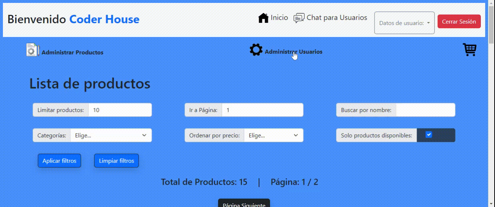

# Cba E-commerce

Proyecto Final del Curso de Programación Backend

## Tabla de Contenidos

-  [Instalación](#instalación)
-  [Scripts](#scripts)
-  [Uso](#uso)
-  [Tecnologías](#tecnologías)
-  [Contribuir](#contribuir)
-  [Autor](#autor)
-  [Link](#link)
-  [Licencia](#licencia)

## Instalación

1. Clona el repositorio.
2. Instala las dependencias con `npm install`.
3. Configura las variables de entorno en un archivo `.env`.
4. Inicia el servidor con `npm start` (por defecto utiliza persitencia de _MongoDB_).

## Scripts

-  `npm run devmongo`: Utiliza _nodemon_ para iniciar el servidor con persistencia en _MongoDB_
-  `npm run devfile`: Utiliza _nodemon_ para iniciar el servidor con persistencia en _FileSystem_.
   **La persistencia FILE tiene algunas características pendientes de desarrollo, por lo que la experiencia es limitada.**
-  `npm run test`: Utiliza _mocha_ para iniciar un test integral al servidor con _supertest_ y _chai_.
   Es necesario que antes se habilite el modo test en la variable correspondiente del archivo _.env_

## Uso

El backend de la aplicación utiliza un **patrón DAO** en su estructura, **patrón DTO** para evitar la exposición de datos sensibles, **patrón factory** para manejar distintas persistencias y **patrón de repository** para los servicios.
En tanto en el frontend se utiliza **handlebars** para las vistas de interacción con el usuario.

Cuenta con un **modulo de test** (_ver sección de Scripts_) y un **mock de productos** en el endpoint para realizar pruebas de rendimiento.

Posee el **logger de winston** para registrar eventos tanto en modo desarrollo como en modo producción, puedes probarlo en el endpoint `/api/loggertest`.

El chat entre usuarios y la administración de productos (agregar, actualizar y eliminar) utiliza **websocket** para que las actualizaciones se efectuen en el momento. Se le incorporó un **manejador de errores** que se puede ampliar según la necesidad del programador y un **controlador de roles** para limitar el acceso a las rutas según el rol del usuario.

Por último para subir archivos y documentos a la carpeta pública se usa **multer** y para dar aviso por mail del ticket de compra, eliminación de cuentas de usuarios inactivos y de productos de usuarios premium se emplea **nodemailer**.

### Usuarios

La aplicación utiliza estrategias de _passport_ para registro de usuarios, **logueo por contraseña y logueo usando credenciales de GitHub**. Asimismo posee un manejo de sesiones de usuario y protección de endpoints utilizando **JWT**.
El _ADMINISTRADOR_ puede ver el listado de usuarios, cambiarles el rol (_USER o PREMIUM_) y eliminar todos aquellos que se encuentren inactivos por más de 2 días. Este usuario se configura mediante variables de entorno.
Los usuarios con rol _USER_ pueden subir documentación, chatear con otros usuarios y comprar productos.
Los usuarios con rol _PREMIUM_ tienen todos los priviliegios de un _USER_ y ademas cuentan con la posibilidad de agregar, actualizar y eliminar productos.
El usuario cuenta con la posibilidad de reestablecer su contraseña en caso de olvidarla y su página de inicio se personaliza según el rol y privilegios, mostrando los botones habilitados.

**Características con rol USER**

**Caraterísticas con rol PREMIUM**

**Caraterísticas con rol ADMINISTRADOR**

### Productos y carritos

El usuario puede aplicar distintos filtros para encontrar el producto deseado, puede entrar a una vista detallada del mismo y agregarlos al carrito.
Dentro del carrito puede agregar o quitar más unidades del producto, eliminarlo, vaciar el carrito y efectuar la compra a través de _Mercado Pago_

Para mayores detalles sobre rutas, schemas, parámetros, requests y responses de productos y carritos puedes acceder al endpoint `/apidocs` del proyecto.

## Tecnologías

-  **Node.js**
-  **Express**
-  **MongoDB**
-  **Mongoose**
-  **Socket.io**
-  **Swagger**
-  **JWT**
-  **GitHub OAuth**
-  **Mercado Pago**
-  **Handlebars**
-  **Faker.js**
-  **Bcrypt**
-  **Cors**
-  **Cookie-parser**
-  **Dotenv**
-  **Multer**
-  **Nodemailer**
-  **Winston**

## Contribuir

1. Haz un fork del proyecto.
2. Crea una nueva rama (`git checkout -b feature/feature-name`).
3. Haz commit a tus cambios (`git commit -am 'Añadir nueva funcionalidad'`).
4. Haz push a la rama (`git push origin feature/feature-name`).
5. Crea un pull request.

## Autor

**Mario Aguilar**
**GitHub:** https://github.com/mario-r-aguilar
**LinkedIn:** https://www.linkedin.com/in/mario-r-aguilar/

## Link

https://cba-e-commerce.up.railway.app

## Licencia

ISC License

Copyright (c) 2024, Mario R. Aguilar

Permission to use, copy, modify, and/or distribute this software for any purpose with or without fee is hereby granted, provided that the above copyright notice and this permission notice appear in all copies.

THE SOFTWARE IS PROVIDED "AS IS" AND THE AUTHOR DISCLAIMS ALL WARRANTIES WITH REGARD TO THIS SOFTWARE INCLUDING ALL IMPLIED WARRANTIES OF MERCHANTABILITY AND FITNESS. IN NO EVENT SHALL THE AUTHOR BE LIABLE FOR ANY SPECIAL, DIRECT, INDIRECT, OR CONSEQUENTIAL DAMAGES OR ANY DAMAGES WHATSOEVER RESULTING FROM LOSS OF USE, DATA OR PROFITS, WHETHER IN AN ACTION OF CONTRACT, NEGLIGENCE OR OTHER TORTIOUS ACTION, ARISING OUT OF OR IN CONNECTION WITH THE USE OR PERFORMANCE OF THIS SOFTWARE.
